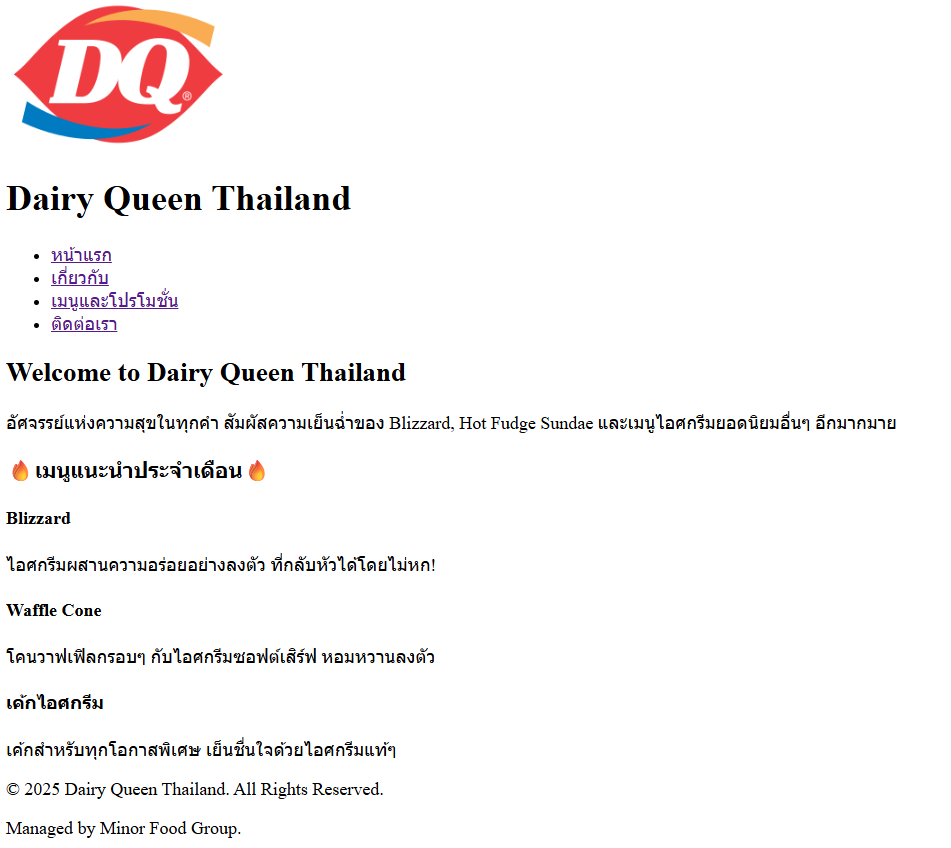

# Dairy Queen Thailand - เว็บไซต์ธุรกิจ

เว็บไซต์จำลองของ **BookLand Co., Ltd.** สำหรับ Assignment#1  
เป็นเว็บไซต์ร้านหนังสือออนไลน์ที่มีบริการจัดชุดหนังสือ ส่งด่วน และดูแลหนังสือ
โปรเจกต์นี้คือเว็บไซต์ตัวอย่างสำหรับธุรกิจ **Dairy Queen Thailand** สร้างขึ้นตามข้อกำหนดของ Assignment#1  เป็นเว็บไซต์แนะนำธุรกิจเกี่ยวกับDairy Queen Thailand มีเมนูโปรโมชั่นแนะนำ

## ข้อมูล Assignment#1

เว็บไซต์ประกอบด้วย **4 หน้าหลัก** ดังนี้:

1. หน้าแรก (Home)
2. เกี่ยวกับเรา (About)
3. เมนูและโปรโมชั่น (Menu and promotions)
4. ติดต่อเรา (Contact)

## โครงสร้างไฟล์

- index.html : หน้าแรก (Home)
- about.html : หน้าเกี่ยวกับเรา (About)
- services.html : หน้าเมนูและโปรโมชั่น (Menu and promotions)
- contact.html : หน้าช่องทางการติดต่อ (Contact)
- images : โฟลเดอร์เก็บรูปภาพ
  - logo.png
  - CEO1.jpg
  - CEO2.jpg
  - CEO3.jpg
  - CEO4.jpg
  - IceCreamCake.jpg
  - blizzard.jpg
  - indexScreenshot.png
  - AboutScreenshot1.png
  - AboutScreenshot2.png
  - ServiceScreenshot1.png
  - ServiceScreenshot2.png
  - ContactScreenshot1.png
  - ContactScreenshot2.png
- README.md : เอกสารประกอบโปรเจกต์

## ลิงก์เข้าสู่หน้าต่างๆ

### [หน้าแรก](index.html)

### [เกี่ยวกับเรา (About)](about.html)

### [บริการของเรา (Services)](services.html)

### [ติดต่อเรา (Contact)](contact.html)

## ผู้จัดทำ

ชื่อ-นามสกุล: นางสาวบุษชยาภา คะสุดใจ
รหัสนิสิต: 67160190